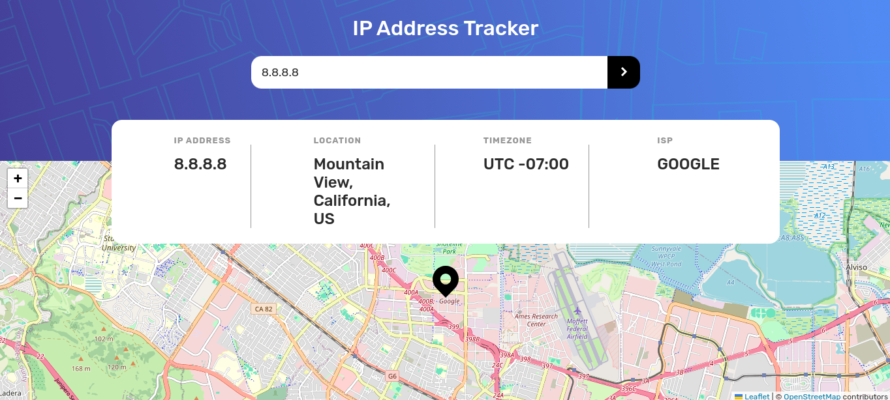

# IP Address Tracker

This project is an IP address tracker built with React. It allows users to search for any IP address or domain and displays information such as the IP address, location, timezone, and ISP. The application also displays the location on a map.

## Features

- Search for any IP address or domain
- Displays IP address, location, timezone, and ISP
- Shows the location on a map

## Technologies Used

- Vite + React
- React Router DOM
- Leaflet.js for the map
- IPAPI for fetching IP address data



## Installation
1. Clone the repository:
   ```bash
    https://github.com/Aayush259/IP-Address-Tracker.git
    ```

2. Navigate to the project directory:
    ```bash
    cd Dictionary
    ```

3. Install dependencies:
    ```bash
    npm install
    ```

4. Start the development server:
    ```bash
    npm run dev
    ```

## Contributing

Pull requests are welcome. For major changes, please open an issue first to discuss what you would like to change.
